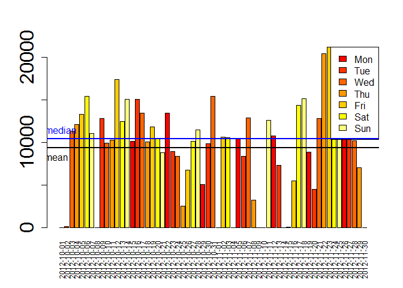
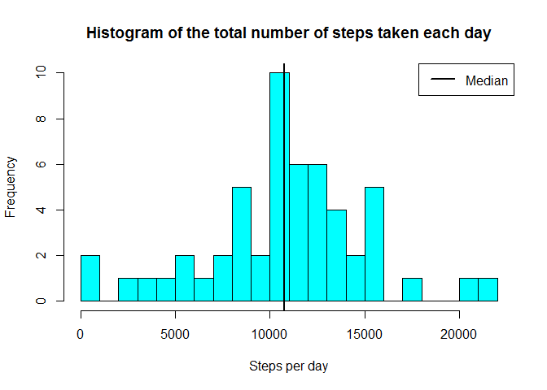
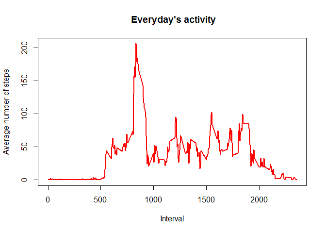
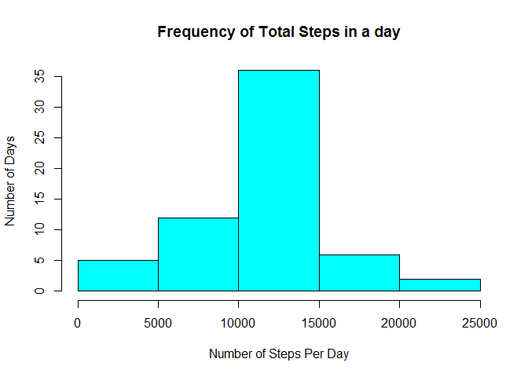
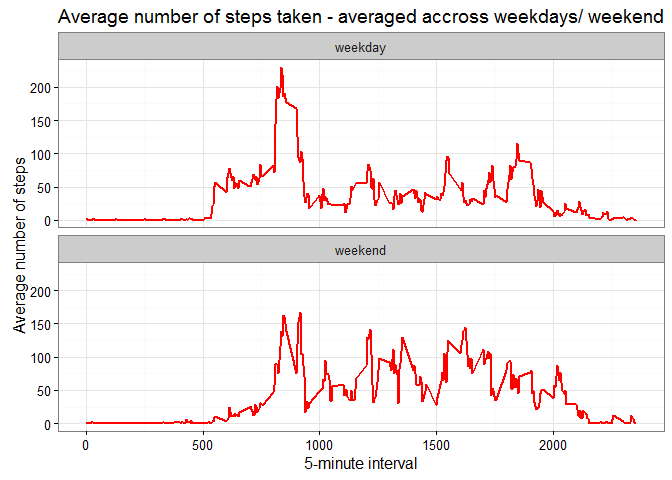

**Assignment 1 - Week 2 - Reproducible Research**
==================================================================================

**Introduction**
-------------------------------------------------

This assignment makes use of data from a personal activity monitoring
device. This device collects data at 5 minute intervals through out the
day. The data consists of two months of data from an anonymous
individual collected during the months of October and November, 2012 and
include the number of steps taken in 5 minute intervals each day.

The variables included in this dataset are:

-   steps: Number of steps taking in a 5-minute interval (missing values
    are coded as NA)
-   date: The date on which the measurement was taken in YYYY-MM-DD
    format
-   interval: Identifier for the 5-minute interval in which measurement
    was taken

**Assignment steps**
-----------------------------------------------------

#### *Clear the workspace*

    rm(list=ls())

#### *Required packages*

    library (knitr)
    library(markdown)
    library(lubridate)

    ## 
    ## Attaching package: 'lubridate'

    ## The following object is masked from 'package:base':
    ## 
    ##     date

    library(dplyr)

    ## 
    ## Attaching package: 'dplyr'

    ## The following objects are masked from 'package:lubridate':
    ## 
    ##     intersect, setdiff, union

    ## The following objects are masked from 'package:stats':
    ## 
    ##     filter, lag

    ## The following objects are masked from 'package:base':
    ## 
    ##     intersect, setdiff, setequal, union

    library(ggplot2)

#### *Loading and preprocessing the data*

The folder repdata\_data\_activity containing the dataset Activity
monitoring data has been downloaded and unzipped within the folder
Assignment1. The path to this working directory is applied.

    setwd("~/Coursera/ReproducibleResearch/Week2/Week2/Assignment1/repdata_data_activity")

Now load the raw data from the csv file, then know the information about
the structure of the file and have a summary of it

    raw_data <- read.csv("activity.csv", header = TRUE, sep = ",",stringsAsFactors=FALSE)
    str(raw_data)

    ## 'data.frame':    17568 obs. of  3 variables:
    ##  $ steps   : int  NA NA NA NA NA NA NA NA NA NA ...
    ##  $ date    : chr  "2012-10-01" "2012-10-01" "2012-10-01" "2012-10-01" ...
    ##  $ interval: int  0 5 10 15 20 25 30 35 40 45 ...

    summary(raw_data)

    ##      steps            date              interval     
    ##  Min.   :  0.00   Length:17568       Min.   :   0.0  
    ##  1st Qu.:  0.00   Class :character   1st Qu.: 588.8  
    ##  Median :  0.00   Mode  :character   Median :1177.5  
    ##  Mean   : 37.38                      Mean   :1177.5  
    ##  3rd Qu.: 12.00                      3rd Qu.:1766.2  
    ##  Max.   :806.00                      Max.   :2355.0  
    ##  NA's   :2304

Lubridate's parsing functions read strings into R as POSIXct date-time
objects. This package is used to format the date in the dataset. And,
see the first 15 rows of the data.

    raw_data$date <- ymd(raw_data$date)
    head(raw_data,15)

    ##    steps       date interval
    ## 1     NA 2012-10-01        0
    ## 2     NA 2012-10-01        5
    ## 3     NA 2012-10-01       10
    ## 4     NA 2012-10-01       15
    ## 5     NA 2012-10-01       20
    ## 6     NA 2012-10-01       25
    ## 7     NA 2012-10-01       30
    ## 8     NA 2012-10-01       35
    ## 9     NA 2012-10-01       40
    ## 10    NA 2012-10-01       45
    ## 11    NA 2012-10-01       50
    ## 12    NA 2012-10-01       55
    ## 13    NA 2012-10-01      100
    ## 14    NA 2012-10-01      105
    ## 15    NA 2012-10-01      110

Get/set days component of a date-time using wday function from Lubridate
is invoked and the first and last several rows of the data set is
viewed. The variables included in this dataset are:

-   steps: number of steps taken per 5-minute interval (missing values
    are coded as NA)
-   date: year-month-day format
-   interval: identifier for the 5-minute interval
-   Weekday: the relevant day of the week

<!-- -->

    raw_data$Weekday<-wday(raw_data$date, label = TRUE, abbr = FALSE)
    head(raw_data)

    ##   steps       date interval Weekday
    ## 1    NA 2012-10-01        0  Monday
    ## 2    NA 2012-10-01        5  Monday
    ## 3    NA 2012-10-01       10  Monday
    ## 4    NA 2012-10-01       15  Monday
    ## 5    NA 2012-10-01       20  Monday
    ## 6    NA 2012-10-01       25  Monday

    tail(raw_data)

    ##       steps       date interval Weekday
    ## 17563    NA 2012-11-30     2330  Friday
    ## 17564    NA 2012-11-30     2335  Friday
    ## 17565    NA 2012-11-30     2340  Friday
    ## 17566    NA 2012-11-30     2345  Friday
    ## 17567    NA 2012-11-30     2350  Friday
    ## 17568    NA 2012-11-30     2355  Friday

#### *Mean total number of steps taken/day*

-   ##### *Bar plot of the total number of steps taken by ignoring the missing values/day*

<!-- -->

    Daytot <- raw_data %>% group_by(date) %>%summarise(sum_steps=sum(steps,na.rm=TRUE),na=mean(is.na(steps)))
    head(Daytot, 20) ## The first 20 rows for example

    ## Source: local data frame [20 x 3]
    ## 
    ##          date sum_steps    na
    ##        (date)     (int) (dbl)
    ## 1  2012-10-01         0     1
    ## 2  2012-10-02       126     0
    ## 3  2012-10-03     11352     0
    ## 4  2012-10-04     12116     0
    ## 5  2012-10-05     13294     0
    ## 6  2012-10-06     15420     0
    ## 7  2012-10-07     11015     0
    ## 8  2012-10-08         0     1
    ## 9  2012-10-09     12811     0
    ## 10 2012-10-10      9900     0
    ## 11 2012-10-11     10304     0
    ## 12 2012-10-12     17382     0
    ## 13 2012-10-13     12426     0
    ## 14 2012-10-14     15098     0
    ## 15 2012-10-15     10139     0
    ## 16 2012-10-16     15084     0
    ## 17 2012-10-17     13452     0
    ## 18 2012-10-18     10056     0
    ## 19 2012-10-19     11829     0
    ## 20 2012-10-20     10395     0

And, the total number of steps taken per day can be presented by a bar
diagram using the following code:

    barplot(height=Daytot$sum_steps,names.arg=Daytot$date,cex.axis= 2, cex.names=0.75,las=3, col=heat.colors(7))
    legend("topright", fill=heat.colors(7), legend=c("Mon", "Tue", "Wed", "Thu", "Fri", "Sat", "Sun"))
    abline(h=median(Daytot$sum_steps), col="blue",lwd=2)
    abline(h=mean(Daytot$sum_steps),lwd=2)
    text(x = 0.5,y=median(Daytot$sum_steps),pos=3,labels = "median", col="blue")
    text(x = -0.5,y=mean(Daytot$sum_steps),pos=1,labels = "mean")

-   ##### *Histogram of the total number of steps taken each day*

A histogram of total number of steps taken each day does not contain
those days where there are missing observations. So a filter is set to
filter all the missing values and sum the steps.

    Daytot <- filter(Daytot, na < 1)
    hist(Daytot$sum_steps,col="cyan",breaks=20,main="Histogram of the total number of steps taken each day",xlab="Steps per day")
    abline(v=median(Daytot$sum_steps), lty=1,lwd=2)
    legend("topright",lty=1,lwd=2,legend="Median")

-   ##### *Mean and median of the total number of steps taken/day*

Based on the data, the mean and the median total number of steps take
per day are calculated from

    SMean <- mean(Daytot$sum_steps,na.rm=TRUE)
    SMedian <- median(Daytot$sum_steps,na.rm=TRUE)
    options(scipen = 999) # disables the scientific notation
    SMean <- round(SMean) # rounding off
    SMeadian <- round(SMedian) # rounding off

and are 10766 and 10765 respectively.

#### *Average daily activity pattern*

-   ##### *Time series plot (i.e. type = "l") of the 5-minute interval (x-axis) and the average number of steps taken, averaged across all days (y-axis)*

<!-- -->

    raw_data_na_omit <- na.omit(raw_data)
    MSI <- tapply(raw_data_na_omit$steps, raw_data_na_omit$interval, mean, na.rm = TRUE) # mean of the steps but broken by interval
    MSIC <- cbind.data.frame(interval = as.integer(names(MSI)),avgsteps = unname(MSI))
    plot(MSIC$interval,MSIC$avgsteps,type = "l",xlab = "Interval",ylab = "Average number of steps",main = " Everyday's activity", col="red", lwd=2)

-   ##### *The 5-minute interval, on average across all the days in the dataset, which contains the maximum number of steps*

<!-- -->

    Max_Avg_Int = MSIC$interval[MSIC$avgsteps == max(MSIC$avgsteps)]

Hence, the 5-minute interval that contains the maximum of steps, on
average across all days is 835.

#### *To input missing values*

-   ##### *The total number of missing values in the dataset is calculated using*

<!-- -->

    TMV=nrow(raw_data[is.na(raw_data$steps),])

and is found to be 2304.

-   ##### *Strategy for filling in the missing values*

-   ##### *Creating a new dataset that is equal to the original dataset but with the missing data filled in (i.e. by replacing the NAs by the mean of the interval).*

The strategy is to replace the missing NA values with the corresponding
mean of the 5-minute interval attribute calculated as follows

    Replaceddata <- raw_data
    sapply(unique(raw_data$interval),function(x) Replaceddata[!complete.cases(Replaceddata) & (Replaceddata$interval == x),1] <<- MSIC$avgsteps[MSIC$interval == x])

    ##   [1]   1.7169811   0.3396226   0.1320755   0.1509434   0.0754717
    ##   [6]   2.0943396   0.5283019   0.8679245   0.0000000   1.4716981
    ##  [11]   0.3018868   0.1320755   0.3207547   0.6792453   0.1509434
    ##  [16]   0.3396226   0.0000000   1.1132075   1.8301887   0.1698113
    ##  [21]   0.1698113   0.3773585   0.2641509   0.0000000   0.0000000
    ##  [26]   0.0000000   1.1320755   0.0000000   0.0000000   0.1320755
    ##  [31]   0.0000000   0.2264151   0.0000000   0.0000000   1.5471698
    ##  [36]   0.9433962   0.0000000   0.0000000   0.0000000   0.0000000
    ##  [41]   0.2075472   0.6226415   1.6226415   0.5849057   0.4905660
    ##  [46]   0.0754717   0.0000000   0.0000000   1.1886792   0.9433962
    ##  [51]   2.5660377   0.0000000   0.3396226   0.3584906   4.1132075
    ##  [56]   0.6603774   3.4905660   0.8301887   3.1132075   1.1132075
    ##  [61]   0.0000000   1.5660377   3.0000000   2.2452830   3.3207547
    ##  [66]   2.9622642   2.0943396   6.0566038  16.0188679  18.3396226
    ##  [71]  39.4528302  44.4905660  31.4905660  49.2641509  53.7735849
    ##  [76]  63.4528302  49.9622642  47.0754717  52.1509434  39.3396226
    ##  [81]  44.0188679  44.1698113  37.3584906  49.0377358  43.8113208
    ##  [86]  44.3773585  50.5094340  54.5094340  49.9245283  50.9811321
    ##  [91]  55.6792453  44.3207547  52.2641509  69.5471698  57.8490566
    ##  [96]  56.1509434  73.3773585  68.2075472 129.4339623 157.5283019
    ## [101] 171.1509434 155.3962264 177.3018868 206.1698113 195.9245283
    ## [106] 179.5660377 183.3962264 167.0188679 143.4528302 124.0377358
    ## [111] 109.1132075 108.1132075 103.7169811  95.9622642  66.2075472
    ## [116]  45.2264151  24.7924528  38.7547170  34.9811321  21.0566038
    ## [121]  40.5660377  26.9811321  42.4150943  52.6603774  38.9245283
    ## [126]  50.7924528  44.2830189  37.4150943  34.6981132  28.3396226
    ## [131]  25.0943396  31.9433962  31.3584906  29.6792453  21.3207547
    ## [136]  25.5471698  28.3773585  26.4716981  33.4339623  49.9811321
    ## [141]  42.0377358  44.6037736  46.0377358  59.1886792  63.8679245
    ## [146]  87.6981132  94.8490566  92.7735849  63.3962264  50.1698113
    ## [151]  54.4716981  32.4150943  26.5283019  37.7358491  45.0566038
    ## [156]  67.2830189  42.3396226  39.8867925  43.2641509  40.9811321
    ## [161]  46.2452830  56.4339623  42.7547170  25.1320755  39.9622642
    ## [166]  53.5471698  47.3207547  60.8113208  55.7547170  51.9622642
    ## [171]  43.5849057  48.6981132  35.4716981  37.5471698  41.8490566
    ## [176]  27.5094340  17.1132075  26.0754717  43.6226415  43.7735849
    ## [181]  30.0188679  36.0754717  35.4905660  38.8490566  45.9622642
    ## [186]  47.7547170  48.1320755  65.3207547  82.9056604  98.6603774
    ## [191] 102.1132075  83.9622642  62.1320755  64.1320755  74.5471698
    ## [196]  63.1698113  56.9056604  59.7735849  43.8679245  38.5660377
    ## [201]  44.6603774  45.4528302  46.2075472  43.6792453  46.6226415
    ## [206]  56.3018868  50.7169811  61.2264151  72.7169811  78.9433962
    ## [211]  68.9433962  59.6603774  75.0943396  56.5094340  34.7735849
    ## [216]  37.4528302  40.6792453  58.0188679  74.6981132  85.3207547
    ## [221]  59.2641509  67.7735849  77.6981132  74.2452830  85.3396226
    ## [226]  99.4528302  86.5849057  85.6037736  84.8679245  77.8301887
    ## [231]  58.0377358  53.3584906  36.3207547  20.7169811  27.3962264
    ## [236]  40.0188679  30.2075472  25.5471698  45.6603774  33.5283019
    ## [241]  19.6226415  19.0188679  19.3396226  33.3396226  26.8113208
    ## [246]  21.1698113  27.3018868  21.3396226  19.5471698  21.3207547
    ## [251]  32.3018868  20.1509434  15.9433962  17.2264151  23.4528302
    ## [256]  19.2452830  12.4528302   8.0188679  14.6603774  16.3018868
    ## [261]   8.6792453   7.7924528   8.1320755   2.6226415   1.4528302
    ## [266]   3.6792453   4.8113208   8.5094340   7.0754717   8.6981132
    ## [271]   9.7547170   2.2075472   0.3207547   0.1132075   1.6037736
    ## [276]   4.6037736   3.3018868   2.8490566   0.0000000   0.8301887
    ## [281]   0.9622642   1.5849057   2.6037736   4.6981132   3.3018868
    ## [286]   0.6415094   0.2264151   1.0754717

    head(Replaceddata)

    ##       steps       date interval Weekday
    ## 1 1.7169811 2012-10-01        0  Monday
    ## 2 0.3396226 2012-10-01        5  Monday
    ## 3 0.1320755 2012-10-01       10  Monday
    ## 4 0.1509434 2012-10-01       15  Monday
    ## 5 0.0754717 2012-10-01       20  Monday
    ## 6 2.0943396 2012-10-01       25  Monday

-   ##### *Histogram of the total number of steps taken each day, and the mean and median total number of steps taken per day.*

<!-- -->

    MSD <- tapply(Replaceddata$steps, Replaceddata$date, sum, na.rm = TRUE); # mean of the steps but broken by date
    MSDC <- cbind.data.frame(date = names(MSD),totalsteps = unname(MSD))
    hist(MSDC[,2], xlab = "Number of Steps Per Day", ylab = "Number of Days", main = "Frequency of Total Steps in a day", col = "cyan")

The mean and median total number of steps taken per day are calculated
using

    meansteps <- mean(MSDC$totalsteps) 

    mediansteps <- median(MSDC$totalsteps)

and are found to be 10766.1886792 and 10766.1886792 after filling the
data respectively. These values differ from the first part of the
assignment slightly such that before filling the data, they were found
to be 10766 and 10765 after rounding respectively.

#### *Are there differences in activity patterns between weekdays and weekends?*

-   ##### *Create a new factor variable in the dataset with two levels - "weekday" and "weekend" indicating whether a given date is a weekday or weekend day.*

-   ##### *Make a panel plot containing a time series plot (i.e. type = "l") of the 5-minute interval (x-axis) and the average number of steps taken, averaged across all weekday days or weekend days (y-axis).*

<!-- -->

    Replaceddata$date <- as.Date(Replaceddata$date, "%Y-%m-%d")
    Replaceddata$weekend <- "weekday"
    Replaceddata$weekend[weekdays(Replaceddata$date) %in% c("Saturday","Sunday")] <- "weekend"
    Replaceddata$weekend <- as.factor(Replaceddata$weekend)
    ArrangedData <- Replaceddata %>%
    group_by(interval, weekend) %>%
    summarize(avgsteps = mean(steps))

The following figure shows that the activity during the weekend has more
peaks than the weekday activity, with a better distribution of effort
along the time, though the activity on the weekday has the greatest peak
from all steps intervals.

    ggplot(ArrangedData, aes(x=interval, y=avgsteps)) + 
    geom_line(color="red", size=1) + 
    facet_wrap(~ weekend, c(2, 1)) +
    labs(x="5-minute interval", y="Average number of steps") +
    ggtitle("Average number of steps taken - averaged accross weekdays/ weekend") +
    theme_bw()

    ## Warning: Only the first value of `nrow` will be used.

